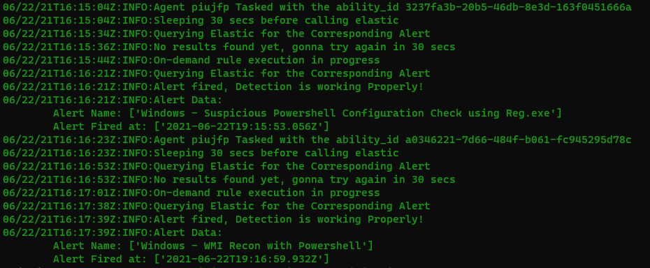
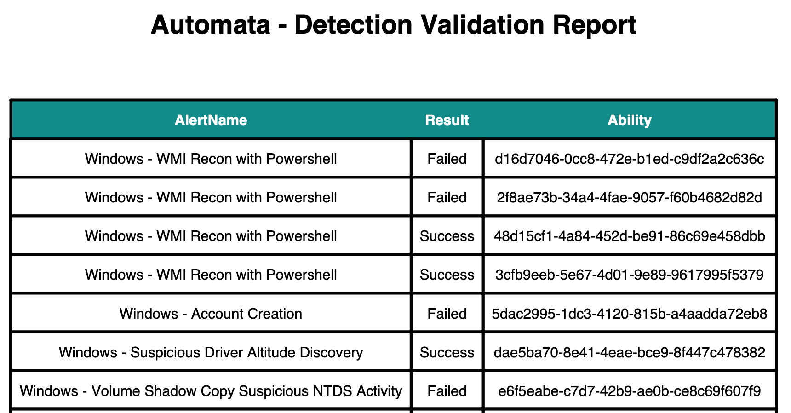

# Automata

<p align="center"></p>

## What

Automata is a tool to detect errors early and measure the Effectiveness of SIEM rules against the behaviors that the rule was developed to work against, ensuring that the whole process of data collection, parsing, and query of security data is working properly and alert when things don't work as intended.

Read more about Automata in our [introductory blog post](https://blog.3coresec.com/2021/06/detection-as-code-dac-challenges.html).

[@_w0rk3r](https://twitter.com/_w0rk3r/) and [@heyibrahimkhan](https://twitter.com/heyibrahimkhan) are the primary authors of Automata.

## Why

Security monitoring has a challenge that is hard to overcome. 
Changes occur daily in a modern enterprise, and some are not that well managed, and if they are internal, service teams aren't involved most of the time. 

Some common examples are: 

* Change in log formats
  * Products are frequently updated and seeing as some require custom parsers due to their format, these updates can easily break the parsing, effectively breaking or affecting the detections.

* The monitored system doesn't have the required configurations applied.
  * Some detections need custom audits and policies to work. And sometimes, this is not defined in the baseline policies, causing gaps in the security monitoring.

* Software Bugs
  * New versions of the products used on our detection pipeline can introduce bugs that will cause errors in our receiving/indexing pipeline. It is of critical importance that those are identified as soon as possible.

Once a problem is identified early, SOC teams can fix these problems before this impacts the detection and response program.

# Setup
  
## Tech Stack

This project uses:

* Elastic
* Sigma Rules
* Caldera
* Python


## Configuration File

To get started, you need to setup a `config.py` in the utils directory, based on the [example config](/utils/configfile.py.example) and modify the following variables:

* `CALDERA_URL`: The URL of the Caldera Server
* `CALDERA_API_KEY`: The API Key for Caldera
* `deployment_type`: The Deployment Type. possible values: "onprem", "cloud"

Variables that should be set if using Elastic Cloud

* `kibana_host`: The URL to Kibana
* `cloud_id`: Elastic Cloud ID

Variables that should be set if using Elastic on-prem

* `kibana_onprem`: The URL to On-prem Kibana
* `elasticsearch_onprem`: The URL to On-Prem Elasticsearch

Password Variables:

* `http_auth_user`: Elastic User
* `http_auth_pass`: Elastic Password

# Usage

There are currently three modes of execution: `Individual Easy`, `Batch` and `Batch Execution In Parallel`.

1. `Individual Easy` executes the workflow for a single Ability.
2. `Batch` executes a list of abilities, one by one.
3. `Batch Execution In Parallel` executes a list of abilities concurrently.

## 1. Individual Easy:

### Required params:

* `-ie`: Switch to enable "Individual Easy" execution type.
* `-afp`: Path to the ability file.
* `-s`: Path to sigma folder. This path when combined with rules path from ability file, makes up the path to the ability relevant rule file. 

### Example:

```
python.exe .\main.py -afp ..\caldera\detection-validation\cloud\aws\guardduty\aws_guardduty_finding_archived.yml -s ..\sigma\rules\ -t jilffn
```

## 2. Batch:

### Required params:

* `-t`: The Target Caldera Agent
* `-af`: The folder containing the Caldera ability files
* `-s`: The folder containing the Sigma Rules installed on the Elastic SIEM

### Example:

```
python .\main.py -t zbuvyg -af 'C:/Users/Jonhnathan/Downloads/caldera-main/caldera-main/detection-validation/windows/' -s "C:/Users/Jonhnathan/Downloads/sigma-master/sigma-master/rules/endpoint/windows/"
```

## 3. Batch Execution In Parallel:

### Required params:

* `-beip`: Switch that enables "Batch Execution In Parallel" execution type.
* `-t`: The Target Caldera Agent
* `-af`: The folder containing the Caldera ability files
* `-s`: The folder containing the Sigma Rules installed on the Elastic SIEM

### Example:

```
python.exe .\main.py -beip -af ..\caldera\detection-validation\cloud\aws\guardduty\ -s ..\sigma\rules\ -t dixiib;
```

### Sample output

<p align="center"></p>

### Sample PDF Report

<p align="center"></p>

## Outputs

Automata generates a PDF report as well as a CSV file with the results of its last execution. By default these files will be stored in the directory where you ran Automata. You can specify a different output directory using the `-o` switch.

# Feedback

Found this interesting? Have a question/comment/request? Let us know!

Feel free to open an [issue](https://github.com/3CORESec/Automata/issues) or ping us on [Twitter](https://twitter.com/3CORESec). We also have a [Community Slack](https://launchpass.com/3coresec) where you can discuss our open-source projects, participate in giveaways and have access to projects before they are released to the public.

[](https://twitter.com/3CORESec)
